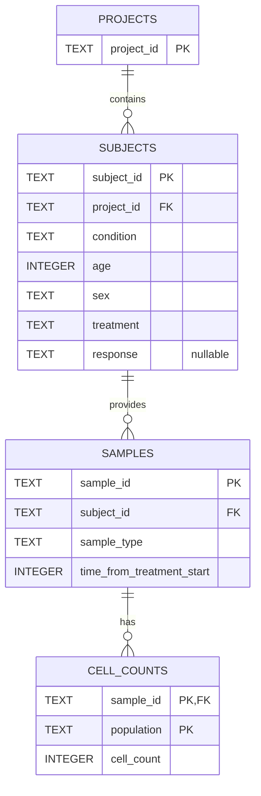

# Clinical Immune-Cell Analysis

**Version 1.0.0** · Python 3.10+ · SQLite · Streamlit

This project loads clinical immune-cell counts into SQLite, calculates cell-population frequencies, compares treatment-response groups, and produces the requested baseline summaries. The pipeline is reproducible and runs without command-line arguments.

## Dashboard

**Live dashboard:** [https://immune-cell-analysis-dashboard.streamlit.app/](https://immune-cell-analysis-dashboard.streamlit.app/)

Run `make dashboard` to open the dashboard locally. The Data Overview tab lets you filter the relative-frequency table and download the results. Treatment Response compares responders and non-responders, shows the statistical analysis, and explains the method. Baseline Analysis contains the requested cohort counts and B-cell result.

## Run the project

In GitHub Codespaces, run these commands from the repository root:

```bash
make setup
make pipeline
make dashboard
```

Streamlit uses port `8501`. Open that port from the Codespaces **Ports** panel.

Run the tests separately:

```bash
make test
```

`make pipeline` recreates `cell_counts.db`, loads `cell-count.csv`, and regenerates every file in `outputs/`.

## Repository layout

```text
.
├── cell-count.csv          # Source data
├── load_data.py            # Validation and database loading
├── analysis.py             # Analysis and output generation
├── dashboard.py            # Streamlit application
├── cell_counts.db          # Generated SQLite database
├── requirements.txt
├── Makefile
├── tests/
└── outputs/
```

The source file uses `condition`, `sex`, and `sample`. These correspond to indication, gender, and sample ID in the assignment wording. Source names are preserved in the database; the relative-frequency output uses the required `sample` column.

## Database design



- `projects` contains one row per project.
- `subjects` contains subject-level clinical metadata and references `projects`.
- `samples` contains sample type and treatment time point and references `subjects`.
- `cell_counts` contains one row per sample and population. Its primary key is `(sample_id, population)`.

Primary keys prevent duplicates, foreign keys enforce relationships, and checks reject negative ages or counts. The following indexes support the main analysis filters:

```sql
idx_subject_analysis(condition, treatment, response)
idx_sample_analysis(sample_type, time_from_treatment_start)
```

The long-form measurement table supports additional cell populations without a schema change. SQLite is appropriate for this read-heavy dataset. For larger datasets, concurrent writers, or distributed analysis, the same model can be moved to PostgreSQL or an analytical warehouse.

## Analysis

### Relative frequencies

For each sample, the pipeline calculates:

```text
total_count = sum of all population counts
percentage  = cell count / total_count × 100
```

The exported table contains `sample`, `total_count`, `population`, `count`, and `percentage`. Zero totals are handled safely, and nonzero sample percentages are validated to sum to approximately 100%.

### Treatment response

The response cohort is limited to melanoma patients receiving miraclib with PBMC samples and a response of `yes` or `no`. There is no baseline-only restriction.

Each subject has repeated measurements at days 0, 7, and 14. The analysis first averages each subject's available percentages by population, then compares responders and non-responders using a two-sided Welch t-test. Welch's test does not assume equal group variances. Benjamini–Hochberg correction controls the false-discovery rate across the five population tests; adjusted p-values below `0.05` are significant.

### Baseline queries

Baseline outputs use melanoma, PBMC, miraclib, and day 0. The final B-cell calculation is separate: responding melanoma males at day 0 across all treatments and sample types, using raw B-cell counts.

## Results

The database contains 3 projects, 3,500 subjects, 10,500 samples, and 52,500 cell measurements. The response cohort contains 656 subjects: 331 responders and 325 non-responders.

| Population | Responder mean (%) | Non-responder mean (%) | Raw p-value | Adjusted p-value |
| --- | ---: | ---: | ---: | ---: |
| B cell | 9.7976 | 9.9963 | 0.1627 | 0.2740 |
| CD4 T cell | 30.5378 | 29.9023 | 0.0045 | 0.0226 |
| CD8 T cell | 24.8819 | 24.9439 | 0.7666 | 0.7666 |
| NK cell | 14.8409 | 15.0732 | 0.1644 | 0.2740 |
| Monocyte | 19.9418 | 20.0843 | 0.4524 | 0.5655 |

CD4 T-cell relative frequency is associated with response after false-discovery-rate correction. This result does not establish causation or validate a predictive model.

The baseline subset contains 656 samples:

- projects: `prj1 = 384`, `prj3 = 272`;
- response: `yes = 331`, `no = 325` distinct subjects;
- sex: `F = 312`, `M = 344` distinct subjects.

The final query includes 485 subjects and returns an average raw B-cell count of **10,206.15**.

## Generated files

| File | Contents |
| --- | --- |
| `outputs/relative_frequencies.csv` | Per-sample population counts and percentages |
| `outputs/response_subject_frequencies.csv` | Subject-level population means |
| `outputs/statistical_results.csv` | Welch tests and adjusted p-values |
| `outputs/response_boxplots.png` | Five-panel response comparison |
| `outputs/baseline_samples.csv` | Matching baseline records |
| `outputs/baseline_project_counts.csv` | Baseline sample counts by project |
| `outputs/baseline_response_counts.csv` | Baseline subjects by response |
| `outputs/baseline_sex_counts.csv` | Baseline subjects by sex |
| `outputs/final_b_cell_average.csv` | Final B-cell average |

## Limitations

- Missing responses are preserved as SQL `NULL`; they are not imputed.
- Subject-level averaging avoids treating repeated samples as independent but does not model time-specific trajectories.
- The analysis tests association only. A longitudinal mixed-effects model would be suitable for a future confirmatory analysis.
